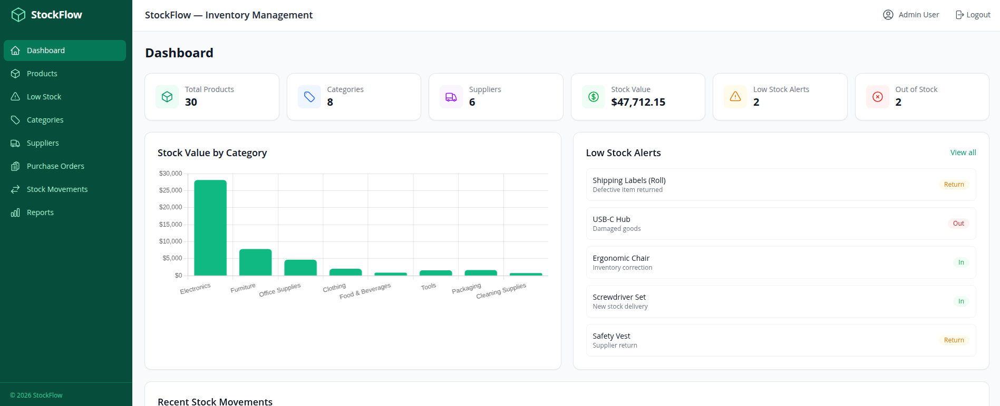
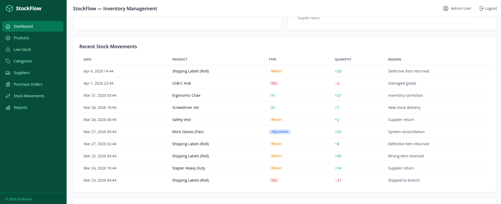
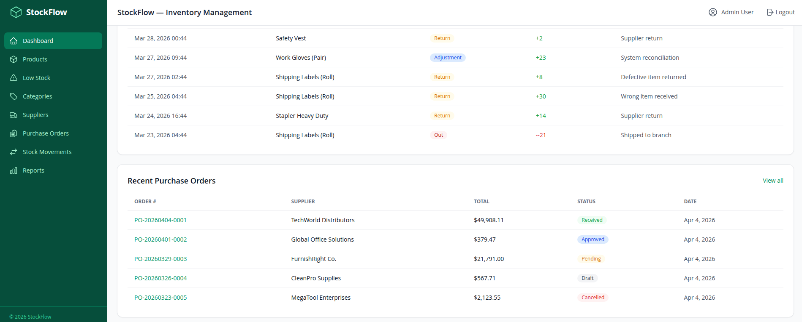
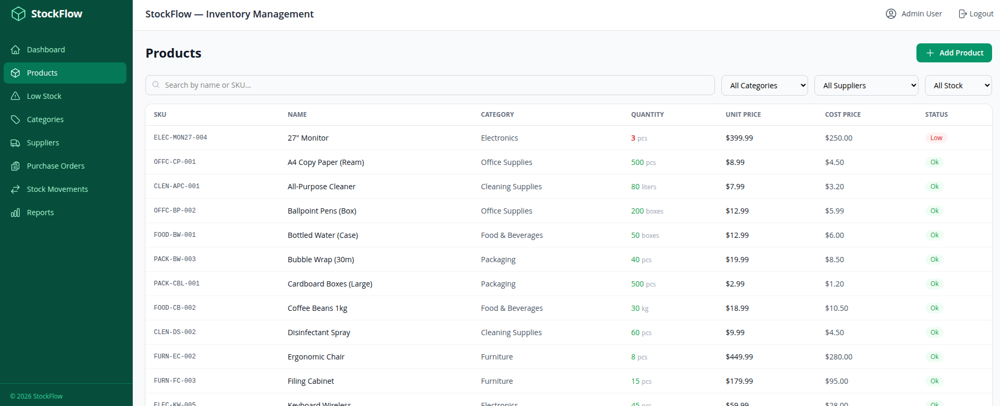
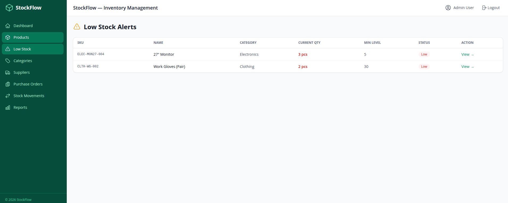

# StockFlow

### Sistem Manajemen Inventori Berbasis Web

StockFlow adalah aplikasi manajemen inventori berbasis web untuk membantu pengelolaan produk, stok, supplier, pembelian, dan pergerakan barang dalam satu sistem yang terintegrasi.

Aplikasi ini menyediakan dashboard untuk memantau kondisi inventori serta berbagai fitur untuk mendukung proses pencatatan dan pengelolaan stok.

---

## Fitur Utama

- Dashboard inventori
- Manajemen produk
- Manajemen kategori
- Manajemen supplier
- Purchase Order
- Pencatatan pergerakan stok
- Penyesuaian stok
- Informasi stok rendah
- Informasi barang habis
- Laporan inventori
- Grafik dan statistik
- Autentikasi pengguna
- Hak akses berdasarkan role

---

## Teknologi

- Laravel 13 — Backend
- PHP 8.4 — Bahasa pemrograman backend
- Vue.js 3 — Frontend
- TypeScript — Pengembangan frontend
- MySQL 8 — Database
- Docker — Container aplikasi
- Docker Compose — Orkestrasi service
- Nginx — Web server
- Tailwind CSS — Styling
- Chart.js — Visualisasi data

---

## Tampilan Aplikasi

### Dashboard

### Manajemen Produk

### Manajemen Kategori

### Manajemen Supplier

### Purchase Order

---

## Struktur Project

stockflow/
├── api/                    # Backend Laravel
├── frontend/               # Frontend Vue.js
├── docker/                 # Konfigurasi Docker dan Nginx
├── screenshots/            # Dokumentasi tampilan aplikasi
├── docker-compose.yml      # Konfigurasi Docker Compose
├── .dockerignore
├── .gitignore
├── LICENSE
└── README.md

---

## Menjalankan Project

Pastikan Docker Desktop sudah berjalan.

Clone repository:

git clone https://github.com/nayla-kirani/stockflow.git

Masuk ke folder project:

cd stockflow

Jalankan seluruh service:

docker compose up -d --build

Cek status container:

docker compose ps

Akses aplikasi:

http://localhost:3001

---

## Konfigurasi Local

Frontend : http://localhost:3001
Backend  : http://localhost:8006
MySQL    : localhost:3309

Port tersebut digunakan untuk menghindari konflik dengan project lain yang berjalan pada komputer.

---

## Akun Demo

### Administrator

Email    : admin@inventory.local
Password : password

### Manager

Email    : manager@inventory.local
Password : password

### Staff

Email    : staff@inventory.local
Password : password

---

## Perintah Pengembangan

Melihat status container:

docker compose ps

Menjalankan project:

docker compose up -d

Menghentikan project:

docker compose down

Membangun ulang image:

docker compose up -d --build

---

## Deployment

StockFlow dapat dijalankan pada server yang mendukung Docker dan Docker Compose.

Sebelum deployment production, konfigurasi environment, database, domain, dan port perlu disesuaikan dengan konfigurasi server.

---

## License

Ketentuan penggunaan project mengikuti file LICENSE yang tersedia di repository.

Atribusi project sumber dipertahankan sesuai ketentuan lisensi.